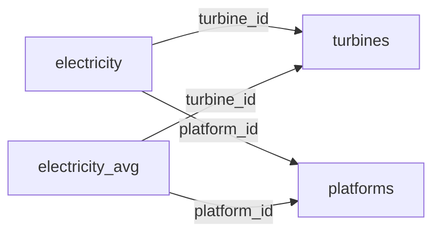

# Interactive Wind Potential Monitoring Offshore Fixed Brazilian Platforms  🌍⚡

A Shiny app for visualizing offshore wind platforms, turbines, and historical energy potential data, integrated with a PostgreSQL database.

## Key Features 🚀
- **Interactive Leaflet Map** with marker clustering and color-coded potential categories.
- **Dynamic Filters**: Select platforms and turbines to analyze.
- **Real-Time Analytics**:
  - Platform coordinates and historical average potential.
  - Time-series charts (Plotly) with moving averages.
- **Secure Database Integration**: Connection pooling via `RPostgres` and `pool`.
- **Responsive UI**: Spinners for loading states and clean layout.

## Built With 🛠️
- **R** (Shiny, Leaflet, Plotly, dplyr)
- **PostgreSQL** (Database)
- **HTML/CSS** (Shiny UI Components)
- **GitHub Actions** (Optional CI/CD)

## Database Structure 📊

### Overview
Wind potential time series data was collected using [Renewable Ninja](https://www.renewables.ninja/). Contains **82 fixed offshore platforms** (active installations) with historical wind generation potential data. As operational data, **values may become outdated** over time.

### Core Tables

1. **`platforms`**  
   - Stores geographic locations of offshore installations  
   - Columns:  
     - `id` (PK): Unique identifier  
     - `installation_name`: Official installation name  
     - `latitude`, `longitude`: Geographic coordinates  

2. **`turbines`**  
   - Contains technical specifications of 14 wind turbine models  
   - Columns:  
     - `id` (PK): Unique identifier  
     - `model`: Turbine model name (e.g., "Vestas V164-9.5MW")  
     - `height`: Operational height (meters)  
     - `capacity`: Max generation capacity (MW)  

3. **`electricity`**  
   - Hourly wind potential time series (raw data)  
   - Columns:  
     - `id` (PK): Unique identifier  
     - `turbine_id` (FK): Reference to `turbines.id`  
     - `platform_id` (FK): Reference to `platforms.id`  
     - `datetime`: Timestamp (YYYY-MM-DD HH:MM:SS)  
     - `value`: Wind potential in kW  

4. **`electricity_avg`** (Optimization Table)  
   - Pre-aggregated 12-hour moving averages for map performance  
   - Same structure as `electricity` table  

### Relationships

- 💾 [Download the DataBase](https://drive.google.com/file/d/1ggZFafbO50tsSW5IcDbqZDqBz96_KKyV/view?usp=drive_link)
## Getting Started ▶️
### Prerequisites
-R(>= 4.0.0)

-PostgreSQL

-R packages:

            install.packages(c("shiny", "leaflet", "DBI", "RPostgres", "pool", 
                 "ggplot2", "dplyr", "lubridate", "plotly", 
                 "shinycssloaders", "memoise"))
                 
Configuration of the DB:

                        DB_HOST="localhost"
                        DB_NAME="OG20W"
                        DB_USER="postgres"
                        DB_PASS="your_secure_password"  # Never commit real credentials!
                        DB_PORT=5432
